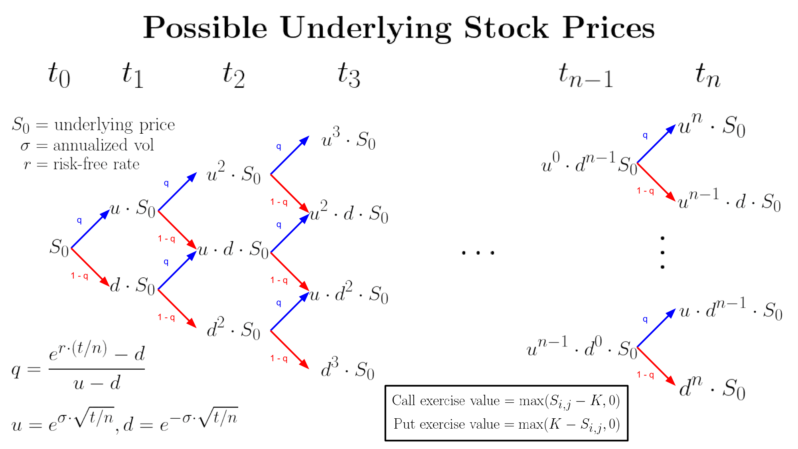
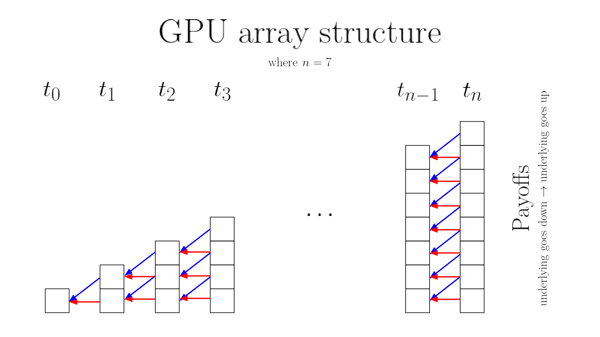
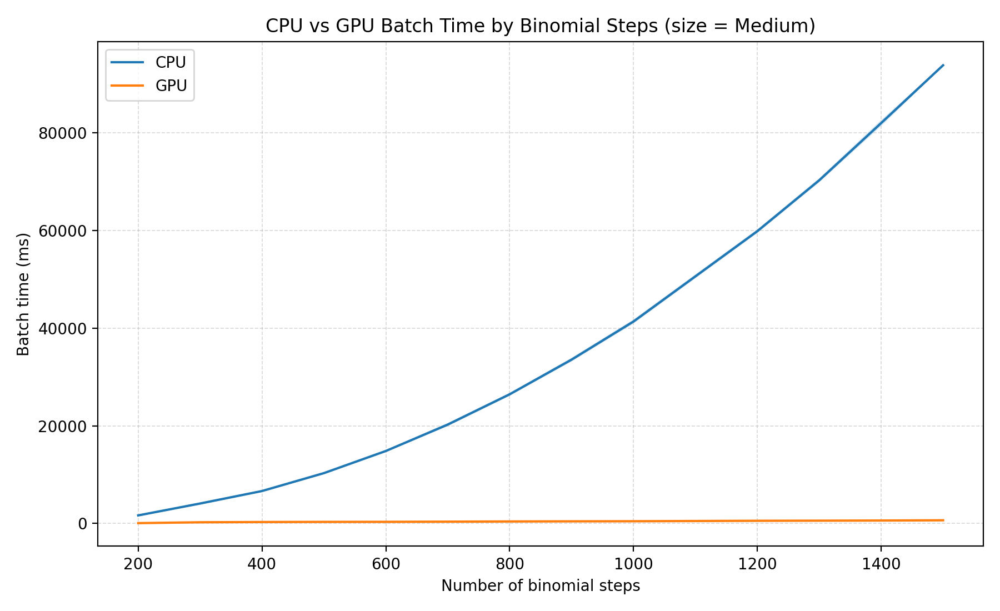
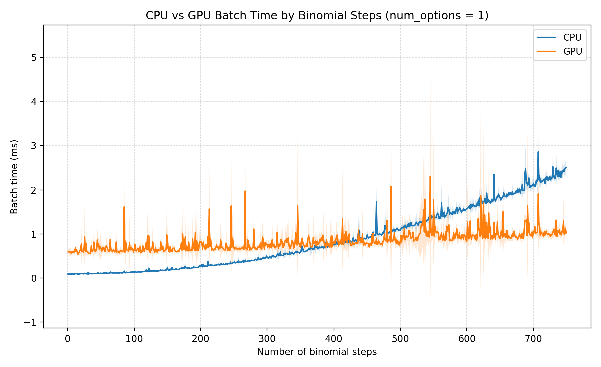
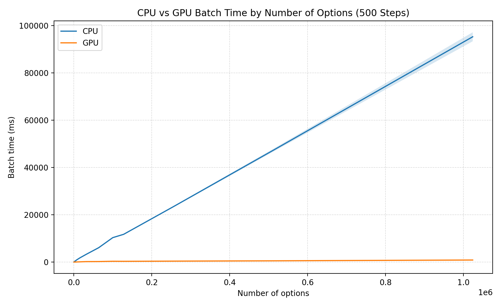

# GPU-Accelerated Fair Value Options Pricing Engine

## Installation and Usage

Required:
- CMake 3.20+
- A C++17 compiler supported by CUDA
- NVIDIA CUDA Toolkit, including `nvcc`
- An NVIDIA GPU with a compatible driver
- A build tool supported by CMake

From the repo root (on Linux computer):
```
cmake -S . -B build -DCMAKE_BUILD_TYPE=Release
cmake --build build -j
./build/options_pricer
```

## Project Description

This project will price the fair value (FV) of American options using the binomial model.

### Technical Challenges

American options can be exercised at any moment before the expiration date, while European options can only be exercised at the expiry. Thus, we're unable to use the Black-Scholes model to easily calculate FVs. Instead, we must use a binomial model to recursively price the original option. This lattice structure can be parallelized on a GPU for performance improvements.

For a single equity option, the cartesian product of expiration dates and strike prices is extremely large. Thus, the high parallelism of GPUs can accelerate FV calculations across an entire option chain and across different chains much faster than CPU-based programs.

## Methodology


This project uses the binomial tree lattice method to price American options. We define the following
- $T$: Total time
- $N$: Number of steps between now and time $T$
- $dt = T / N$: The timestep
- $u = e^{\sigma \cdot \sqrt{dt}}$: TODO (up multiplier)
- $d = e^{-\sigma \cdot \sqrt{dt}}$: TODO (down multiplier)
- $q = (exp(r \cdot dt) - d) / (u - d)$: The risk-neutral up probability

### Assumptions
- No dividends
- Constant vol
- Constant risk-free rate
- Markets are frictionless: no transaction costs, no bid/ask spread, no taxes, no short-selling restrictions, trades are instant, etc
- Markets are arbitrage-free: there is no strategy that gives you guaranteed profit with no risk and no net cost

The underyling price movies multiplicatively and approximates geometric Brownian motion. So, over a small timestep $dt$, log-price volatility scales like $\sigma \cdot sqrt{dt}$. Log-price volatility means that the volatility is measured in log returns $\log(S_{next} / S_{now})$, rather than just $S_{next} / S_{now}$. The result of the log return is equal to the rate if the interest was compounded continuously where $S_{next} = S_{now} \cdot e^{\text{log price volatility}}$. This model is also a simplified two-point approximation with moves at $+\sigma \cdot sqrt{dt}$ and $-\sigma \cdot sqrt{dt}$.

Thus, the up log-return is $+ \sigma \cdot \sqrt{dt}$, while the down log-return is $- \sigma \cdot \sqrt{dt}$. Since they're reciprocals and the returns are multiplicative, and (up and down) or (down and up) results in the original price.

$q$ is the chance that the stock price goes up, while $1-q$ is the chance that the stock price goes down. We assume that there's no way to make a risk-free profit with zero net investment. Thus, the expected stock growth over one step must equal the risk-free growth. Proof to calculate $q$.
- $E[S_{next}] = S_0 e^{r \cdot dt}$ <- risk free rate growth
- $E[S_{next}] = q S_0 u + (1-q) S_0 d$ <- binomial tree structure
- $S e^{r \cdot dt} = q S_0 u + (1-q) S_0 d$
- $e^{r \cdot dt} = q u + (1-q) d$ <- cancel $S_0$
- $q = \frac{e^{r \cdot dt} -d}{u - d}$ <- some algebra to solve for $q$

### Continuation vs Exercise
Now, we can find the following
- Continuation value = $e^{-r \cdot dt} (q \cdot S_0 \cdot u + (1-q) \cdot S_0 \cdot d)$
- Exercise value = $max(S - K, 0)$ for calls and $max(K - S, 0)$ for puts

So, we value the option as the max of continuation vs exercise value.

### GPU Implementation


The kernel launches 1 block per option to price. Then, each thread $i$ calculates the payoff at index $i$ for each timestep, starting at timestep $t_n$ to the current price $t_0$. The array at time $t_j$ is sorted by the net number of underlying "up" movements, from lowest to highest. So, thread $i$ can calculate the payoff from if the underlying goes up ($arr_{j+1}[i+1]$) or if the underlying does down ($arr_{j+1}[i]$). As the main loop progresses and timestep $t_j$ approaches $t_0$, the total number of active threads decreases. But this is fine, because fundamentally the induction process is a serial operation, which a GPU cannot speedup. Thus, the calculations at each timestep are parallelized, and the operation of calculating each given option price is parallelized. Kernel is found at [src/pricing/gpu_pricer.cu](src/pricing/gpu_pricer.cu)

## Project Features

- GPU-based FV options pricer
- CPU-based FV options pricer
- Tests to ensure cpu and gpu correctness in `src/tests/`
- Scripts to plot the runtime w.r.t. the number of binomial steps and the number of options
- Example script to plot example call surface

## Results

### Performance Analysis (CPU vs GPU)

#### Runtime vs Binomial Steps


The CPU and GPU runtimes w.r.t. the number of binomial steps. The higher the number of steps, the more accurate the option price estimation is. the CPU runtime is exponential because for each additional layer in the binomial lattice structure, a $t+1$ length array is added. Thus, you must do $t+1$ more calculations (for the final layer payoffs) and $t$ more calculations for the additional layer of backward induction. The GPU runtime remains linear, because all the threads are able to do the initial payoff calculations and the subsequent backward induction calculation in parallel. So for CPU, $O(t)$ runtime is added, while only $O(1)$ runtime is added for GPU. This figure generated with [`scripts/graph_steps.py`](scripts/graph_steps.py).


The main speedup from GPU comes from backwards induction. So, I wanted to isolate the speedup of just pricing 1 option, but we change the number of steps. This also gets rid of the GPU parallelization from running multiple blocks simultaneously (1 block is launched per option). With my current CPU and GPU setup, the breakpoint is at about 425 steps. For each step value, 10 experiments were run. The shaded areas around the lines are the standard deviation for each point. This figure generated with [`scripts/graph_steps_1_option.py`](scripts/graph_steps_1_option.py).

#### Runtime vs Number of Options


The CPU and GPU runtimes w.r.t. the number of option to price are both $O(n)$. But the GPU just has a lot better parallelization, so the amount of time required to calculate the price of a single option is a lot lower. This mainly comes from the backward induction GPU speedup. This figure generated with [`scripts/graph_num_options.py`](scripts/graph_num_options.py).

## Sanity Check

## Potential Improvements
- check runtime and accuracy performance from using double instead of floats
- include dividend payments in the pricing engine