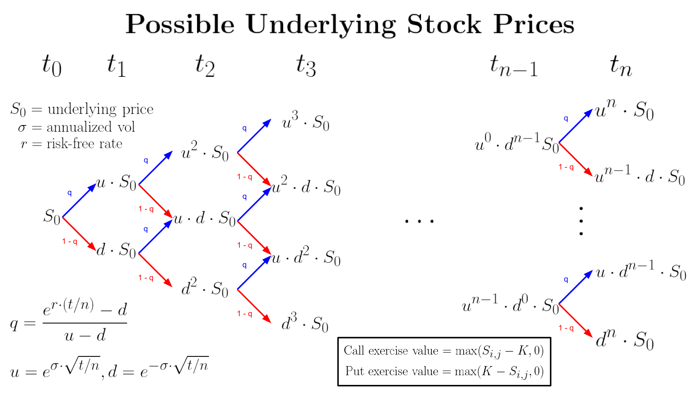
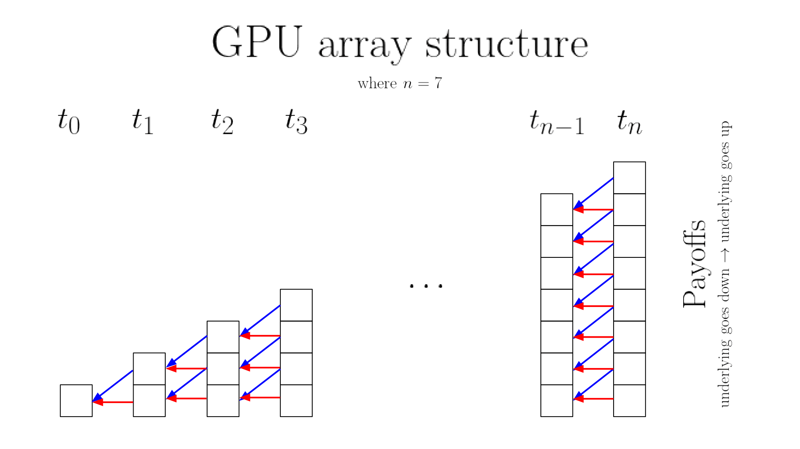
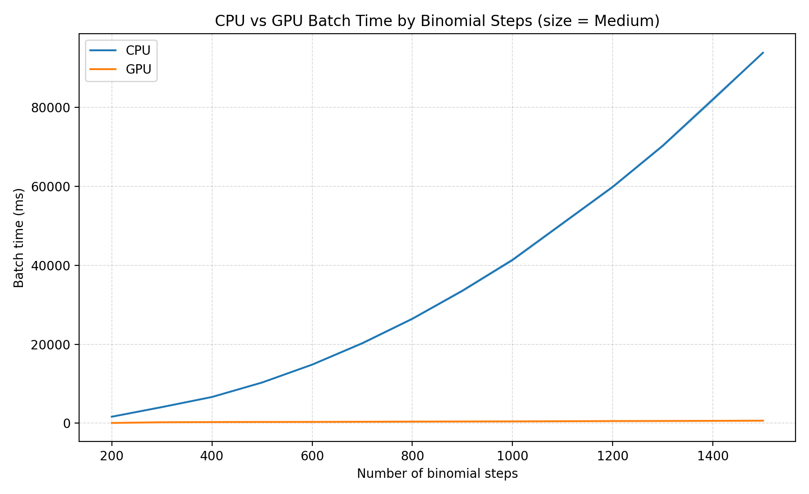
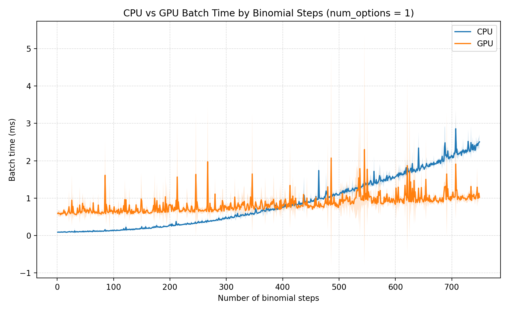
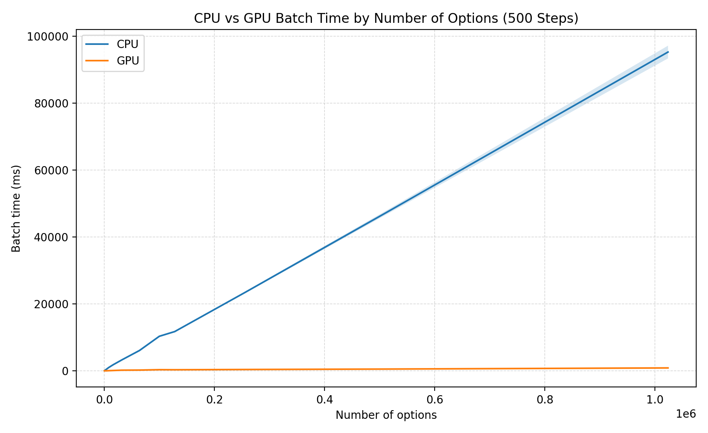
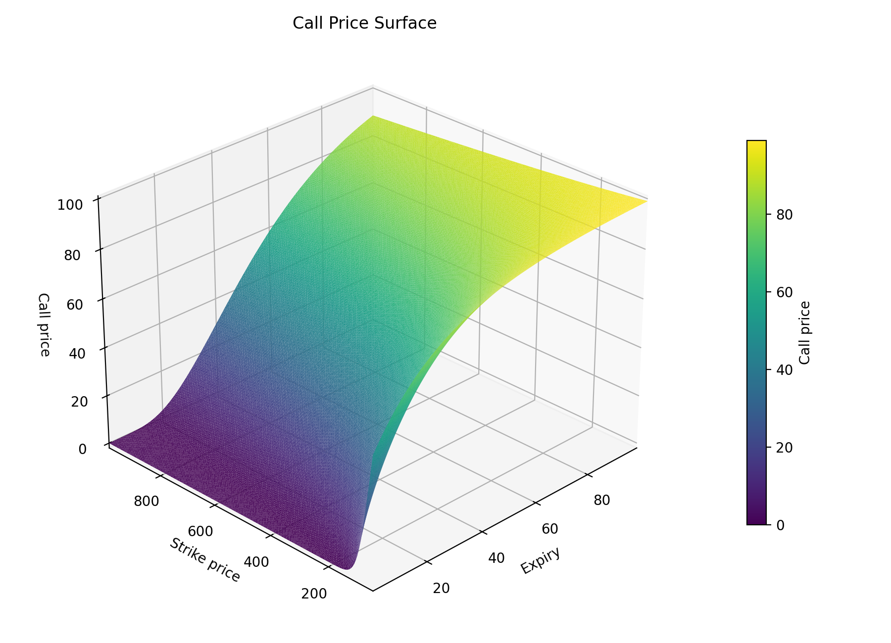

# GPU-Accelerated Fair Value Options Pricing Engine

## Installation and Usage

### Requirements
Required:
- CMake 3.20+
- A C++17 compiler supported by CUDA
- NVIDIA CUDA Toolkit, including `nvcc`
- An NVIDIA GPU with a compatible driver
- A build tool supported by CMake
- Internet connection to pull gtest framework

### Usage
A single executable runs both the cpu and gpu implementations. Then, the same script checks the GPU's correctness against the CPU's outputs.

From the repo root (on Linux computer):
```
cmake -S . -B build -DCMAKE_BUILD_TYPE=Release
cmake --build build -j
./build/options_pricer
```

## Project Features

- GPU-based FV options pricer
- CPU-based FV options pricer
- Tests to ensure general financial properties and cpu/gpu correctness in `src/tests/`
- Scripts to plot the runtime w.r.t. the number of binomial steps and the number of options
- Example script to plot example call surface prices generated from GpuPricer

## Project Description

This project prices the fair value (FV) of American options using the binomial model.

### Technical Challenges

American options can be exercised at any moment before the expiration date, while European options can only be exercised at the expiry. Thus, we're unable to use the Black-Scholes model to easily calculate FVs of American options. Instead, we must use a binomial model to recursively price the original option. This lattice structure can be parallelized on a GPU for performance improvements.

For a single equity option, the cartesian product of expiration dates and strike prices is extremely large. Thus, the high parallelism of GPUs can accelerate FV calculations across an entire option chain and across different chains much faster than CPU-based programs.

## Methodology


This project uses the binomial tree lattice method to price American options. We define the following
- $T$: Total time
- $N$: Number of steps between now and time $T$
- $dt = T / N$: The timestep
- $u = e^{\sigma \cdot \sqrt{dt}}$: the up multiplier for the underlying price over one timestep
- $d = e^{-\sigma \cdot \sqrt{dt}}$: the down multiplier for the underlying price over one timestep
- $q = (exp(r \cdot dt) - d) / (u - d)$: The risk-neutral up probability (proven below)

### Assumptions
- No dividends
- Constant vol
- Constant risk-free rate
- Markets are frictionless: no transaction costs, no bid/ask spread, no taxes, no short-selling restrictions, trades are instant, etc
- Markets are arbitrage-free: there is no strategy that gives you guaranteed profit with no risk and no net cost

The underyling price movies multiplicatively and approximates geometric Brownian motion. So, over a small timestep $dt$, log-price volatility scales like $\sigma \cdot \sqrt{dt}$. Log-price volatility means that the volatility is measured in log returns $\log(S_{next} / S_{now})$, rather than just $S_{next} / S_{now}$. The result of the log return is equal to the rate if the interest was compounded continuously where $S_{next} = S_{now} \cdot e^{\text{log price volatility}}$. This model is also a simplified two-point approximation with moves at $+\sigma \cdot \sqrt{dt}$ and $-\sigma \cdot \sqrt{dt}$.

Thus, the up log-return is $+ \sigma \cdot \sqrt{dt}$, while the down log-return is $- \sigma \cdot \sqrt{dt}$. Since they're reciprocals and the returns are multiplicative, and (up and down) or (down and up) results in the original price.

$q$ is the chance that the stock price goes up, while $1-q$ is the chance that the stock price goes down. We assume that there's no way to make a risk-free profit with zero net investment. Thus, the expected stock growth over one step must equal the risk-free growth. Proof to calculate $q$.
- $E[S_{next}] = S_0 e^{r \cdot dt}$ <- risk free rate growth
- $E[S_{next}] = q S_0 u + (1-q) S_0 d$ <- binomial tree structure
- $S e^{r \cdot dt} = q S_0 u + (1-q) S_0 d$
- $e^{r \cdot dt} = q u + (1-q) d$ <- cancel $S_0$
- $q = \frac{e^{r \cdot dt} -d}{u - d}$ <- some algebra to solve for $q$

### Continuation vs Exercise
Now, we can find the following
- Continuation value = $e^{-r \cdot dt} (q \cdot S_0 \cdot u + (1-q) \cdot S_0 \cdot d)$
- Exercise value = $max(S - K, 0)$ for calls and $max(K - S, 0)$ for puts

So, we value the option as the max of continuation vs exercise value.

### GPU Implementation


Since the value of an option at time $t_j$ depends on its possible values at $t_{j+1}$, this method is a backwards induction.

The kernel launches 1 block per option to price. Then, each thread $i$ calculates the payoff at index $i$ for the given timestep, starting at timestep $t_n$ to the current price $t_0$. The array at time $t_j$ is sorted by the net number of underlying "up" movements, from lowest to highest. So, thread $i$ can calculate the payoff from if the underlying goes up ($arr_{j+1}[i+1]$) or if the underlying does down ($arr_{j+1}[i]$). This is demonstrated by the blue and red arrows above. The blue corresponds with the price if the underlying went up, and the red corresponds with the price if the underlying went down. As the main loop progresses and timestep $t_j$ approaches $t_0$, the total number of active threads decreases. But this is fine, because fundamentally the induction process is a serial operation, which a GPU cannot speedup. Each layer of calculation depends on the previous layer. 

The calculations of the array at each timestep are still parallelized, so there's still a lot of speedup from using a GPU. And the entire operations of calculating the options are parallelized, with a block launching for each option to price. The CUDA kernel is found at [src/pricing/gpu_pricer.cu](src/pricing/gpu_pricer.cu)

## Tests

The test suite in `src/tests/` uses GoogleTest to check financial properties that should hold for both the CPU and GPU pricers:
- CPU and GPU prices match within a small floating-point tolerance
- call prices increase as spot increases
- put prices decrease as spot increases
- call prices decrease as strike increases
- put prices increase as strike increases
- prices are non-negative and at least intrinsic value
- prices increase with volatility
- prices increase with maturity

Install GoogleTest with:
```
sudo apt install libgtest-dev
```

Run all tests with CTest:
```
cmake -S . -B build -DCMAKE_BUILD_TYPE=Release
cmake --build build -j
ctest --test-dir build --output-on-failure
```

Or run the test executable directly:
```
./build/pricer_tests --gtest_color=yes
```

## Results

### Performance Analysis (CPU vs GPU)

#### Runtime vs Binomial Steps


The CPU and GPU runtimes w.r.t. the number of binomial steps. The higher the number of steps, the more accurate the option price estimation is. The CPU runtime is polynomial because for each additional layer in the binomial lattice structure, a $t+1$ length array is added. So, layer $t$ has to do $O(t)$ more calculations than before for the additional step of backward induction, adding $O(t)$ to the runtime. The GPU runtime remains linear, because all the threads in the given block are able to do the additional backward induction calculation in parallel. So for CPU, $O(t)$ runtime is added, while only $O(1)$ runtime is added for GPU. This figure generated with [`scripts/graph_steps.py`](scripts/graph_steps.py).

Since the runtime is exponential for the CPU implementation and linear for the GPU implementation, the GPU implementation is obviously many times faster than the CPU implementation, assuming the number of steps is large. CPU is $O(n^2)$ while GPU is $O(n)$.

Example experiments for this figure found at [`scripts/step_script.sh`](scripts/step_script.sh). The script for generating this figure assumes size = `medium`. 


The main speedup from GPU comes from backwards induction. So, I wanted to isolate the speedup of just pricing 1 option, but we change the number of steps. This also gets rid of the GPU parallelization advantage from running multiple blocks simultaneously (1 block is launched per option). With my current CPU and GPU setup, the breakpoint is at about 425 steps. For each step value, 10 experiments were run. The shaded areas around the lines are the standard deviation for each point. This figure generated with [`scripts/graph_steps_1_option.py`](scripts/graph_steps_1_option.py).

#### Runtime vs Number of Options


The CPU and GPU runtimes w.r.t. the number of option to price are both $O(n)$, assuming that each calculation has the same number of steps. However, the GPU has much higher throughput for large batches because each option is priced by an independent CUDA block, and the payoff/backward-induction work within each timestep is parallelized across threads in each block. As a result, the average time per option is much lower. This figure generated with [`scripts/graph_num_options.py`](scripts/graph_num_options.py).

The GPU implementation is many orders of magnitude faster than the CPU implementation.

Example experiments for this figure found at [`scripts/num_options_script.sh`](scripts/num_options_script.sh). The script for generating this figure assumes steps = `500`. 

## Sanity Check

Run:
```
cmake -S . -B build -DCMAKE_BUILD_TYPE=Release
cmake --build build -j
./build/call_surface

python scripts/graph_call_surface.py
```



For a sanity check, I wanted to see if the surface of the price of a call option chain matched what should be expected. This relationship matches expectations. As the expiration date increases, the price of the option goes up. As the strike price increases, the price goes down.

## Potential Improvements
- check runtime and accuracy performance from using double instead of floats
- include dividend payments in the pricing engine
